# BADA(Bit-computer Art Drawing App)
비트 컴퓨터에선 자체적인 드로잉 앱을 구현하려 합니다.
이 프로젝트를 어떤 한 명의 선생님이 맡게 되었습니다!
그 선생님은 다양한 것들을 만들었지만 마감 시간까지 드로잉 앱에 필요한 핵심 기능들을 구현하지 못할 위기에 처했습니다.
비트 컴퓨터를 위해 수강생 여러분들이 기능을 구현해주세요!

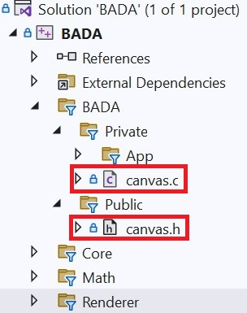

[다운로드 및 실행 방법](#다운로드-및-실행-방법)을 참조하여 솔루션 파일을 연 뒤 솔루션 탐색기에서 **BADA/Public/canvas.h**에 있는 기능들을 모두 구현해주시면 됩니다.
구현은 **BADA/Private/canvas.c**에 해주세요!
[참고사항](#참고사항)도 함께 읽어서 진행해주세요.

구현해야 할 기능은 다음과 같습니다.

## 1. set_canvas() 함수
- 매개변수
    - **uint32_t\*** - 앞으로 사용할 캔버스
    - **size_t** - 캔버스 행 개수
    - **size_t** - 캔버스 열 개수
- 반환값
    - **void** - 이 함수는 아무것도 반환하지 않는다.

앞으로 사용하게 될 캔버스와 캔버스의 행, 열을 설정한다.

## 2. release_canvas() 함수
- 매개변수
    - **void** - 이 함수는 아무것도 받지 않는다.
- 반환값
    - **void** - 이 함수는 아무것도 반환하지 않는다.

사용한 자원을 해제한다.

## 3. draw_pixel() 함수
- 매개변수
    - **size_t** - 픽셀의 x 위치
    - **size_t** - 픽셀의 y 위치
    - **uint32_t** - rgb 색상(r8g8b8)
- 반환값
    - **void** - 이 함수는 아무것도 반환하지 않는다.

[x, y] 위치에 픽셀을 그린다.

## 4. remove_pixel() 함수
- 매개변수
    - **size_t** - 픽셀의 x 위치
    - **size_t** - 픽셀의 y 위치
- 반환값
    - **void** - 이 함수는 아무것도 반환하지 않는다.

[x, y] 위치에 있는 픽셀을 0xFFFFFF로 초기화한다.

## 5. fill_canvas() 함수
- 매개변수
    - **uint32_t** - rgb 색상(r8g8b8)
- 반환값
    - **void** - 이 함수는 아무것도 반환하지 않는다.

입력 받은 rgb 색상으로 캔버스를 채운다.

## 6. draw_horizontal_line() 함수
- 매개변수
    - **size_t** - 가로 줄의 y 위치
    - **uint32_t** - rgb 색상(r8g8b8)
- 반환값
    - **void** - 이 함수는 아무것도 반환하지 않는다.

y 위치에 가로 줄을 그린다.

## 7. draw_vertical_line() 함수
- 매개변수
    - **size_t** - 세로 줄의 x 위치
    - **uint32_t** - rgb 색상(r8g8b8)
- 반환값
    - **void** - 이 함수는 아무것도 반환하지 않는다.

x 위치에 세로 줄을 그린다.

## 8. draw_rectangle() 함수
- 매개변수
    - **size_t** - 사각형의 시작 x 위치 (좌측 상단의 x 위치)
    - **size_t** - 사각형의 시작 y 위치 (좌측 상단의 y 위치)
    - **size_t** - 사각형의 끝 x 위치 (우측 하단의 x 위치)
    - **size_t** - 사각형의 끝 y 위치 (우측 하단의 y 위치)
    - **uint32_t** - rgb 색상(r8g8b8)
- 반환값
    - **void** - 이 함수는 아무것도 반환하지 않는다.

사각형의 좌측 상단 위치, 우측 하단의 위치 안에 있는 범위에 모두 픽셀을 그린다.

## 9. undo() 함수
- 매개변수
    - **void** - 이 함수는 아무것도 받지 않는다.
- 반환값
    - **int** - undo에 성공했다면 TRUE(1), 실패했다면 FALSE(0)을 반환한다.

가장 최근에 입력된 명령어를 취소한다.

최근 256개의 명령어만 되돌릴 수 있다.

## 10. redo() 함수
- 매개변수
    - **void** - 이 함수는 아무것도 받지 않는다.
- 반환값
    - **int** - redo에 성공했다면 TRUE(1), 실패했다면 FALSE(0)을 반환한다.

가장 최근에 취소한 명령을 되돌린다.

최근에 삭제된 256개의 명령어만 되돌릴 수 있다.

## 참고사항
1. **canvas.c**에 있는 전역 변수를 활용하여 캔버스에 필요한 기능들을 구현해야 한다.
    ``` cpp
    // canvas.c
    
    static uint32_t* s_canvas;
    static size_t s_rows;
    static size_t s_cols;
    ```
    필요하다면 전역 변수 추가를 허용한다.

    단, 다른 파일에서 접근하지 못하도록 **static** 키워드를 추가하며, 변수명은 static 전역 변수를 뜻하는 **'s_'** 를 접두사로 붙인다.

2. 
    ``` cpp
    uint32_t, int32_t
    // 각각 부호없는 32비트 정수형, 부호있는 32비트 정수형
    ```
    이러한 자료형은 고정폭 정수형이라고 부른다. **stdint.h**에 정의되어 있으며, C99부터 사용 가능하다.

    해당 프로젝트에선 **int, unsigned int** 등의 기본 정수 자료형 대신 이를 사용해야 한다.

3. 
    ``` cpp
    size_t
    ```
    **stddef.h**에 정의되어 있으며, 크기를 나타내는 부호없는 정수타입이다.
    
    해당 프로젝트에선 크기를 나타낼 때 **int, unsigned int** 등의 기본 정수 자료형 대신 이를 사용해야 한다.

4. **동적 할당**을 허용한다.

5. 필요하다면 **함수, 구조체, 열거형** 등의 추가를 허용한다. **단, 기존의 함수와 열거형은 변경할 수 없다.**

6. 1차원을 2차원처럼 사용하기

    ``` cpp
    int nums[3][5] =
    {
        { 1, 2, 3, 4, 5 },
        { 6, 7, 8, 9, 10 },
        { 11, 12, 13, 14, 15 }
    };
    int* p_nums = nums;

    // nums[2][3]은 14
    // p_nums + 2 * 5 + 3은 14
    // => 1차원에서 2차원을 접근하려면 (y * <열의 개수> + x)
    ```

## 요구사항
1. Windows 운영체제
2. Visual Studio 2019 이상 (기본 세팅은 Visual Studio 2022 Community)

## 다운로드 및 실행 방법
1. Open with Visual Studio 클릭
    
    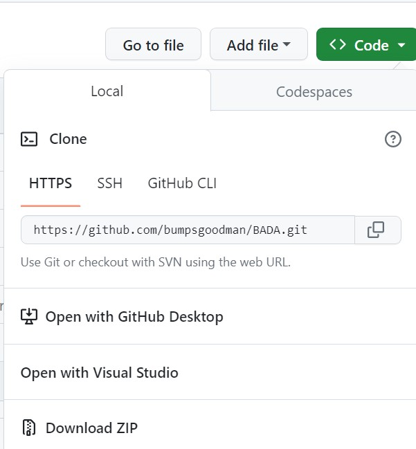

2. Path에 "원하는 경로\BADA" 입력 후 Clone 클릭

    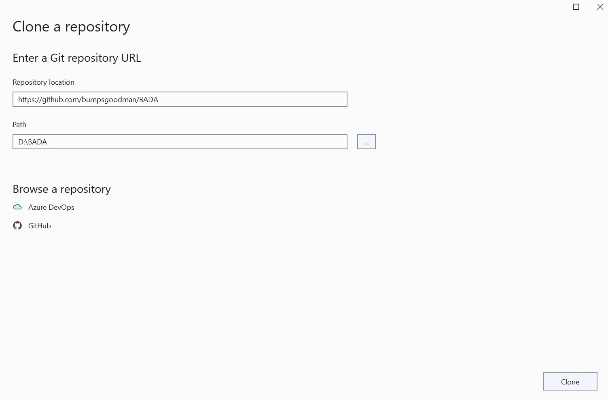

3. BADA\Project 위치에 있는 BADA.sln 파일 열기

    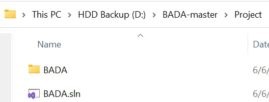

4. 로컬 Windows 디버거 혹은 F5를 눌러 실행

    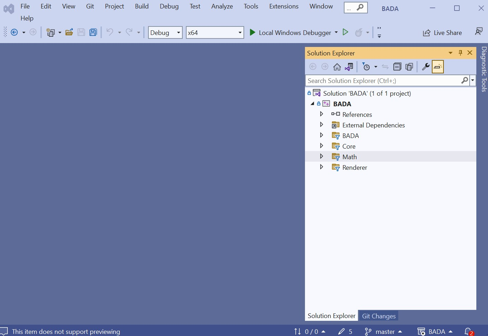

## 실행 예시

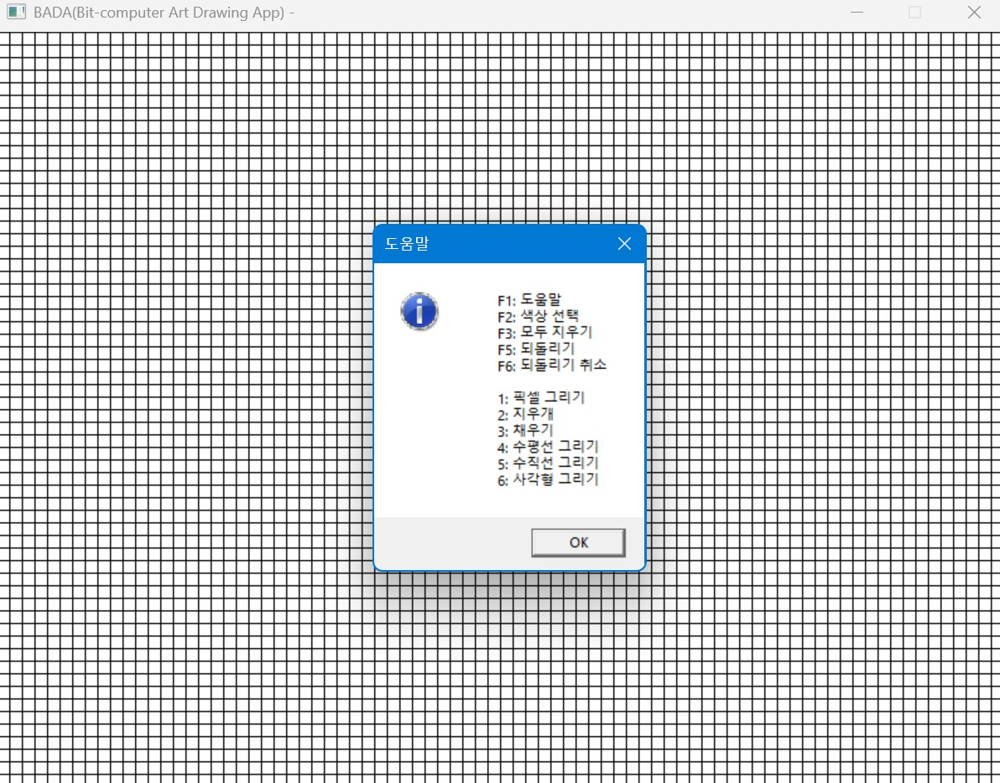 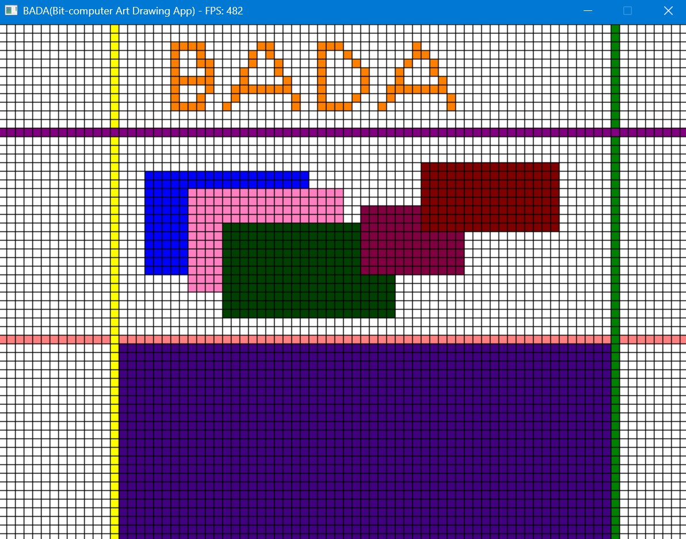

## 깃허브에 업로드 방법
1. 깃 탭을 누른 뒤, master 클릭, 새로운 브랜치 생성

    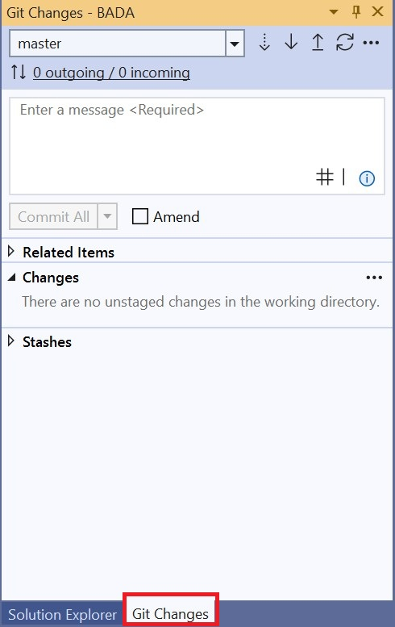
    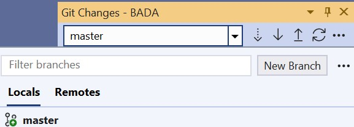

2. 브랜치 이름에 자신의 닉네임 입력 후 생성

    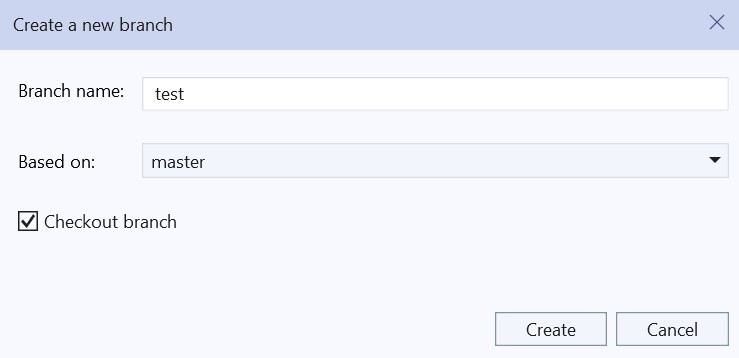

3. Commit 메시지 작성 후 모두 Commit, Push 버튼으로 깃허브에 업로드

    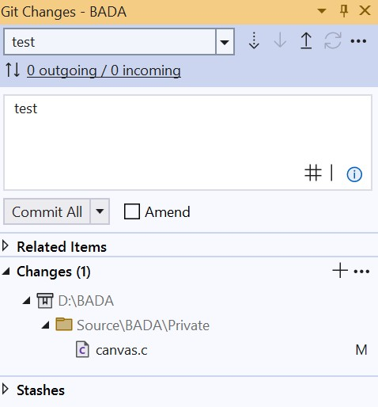
    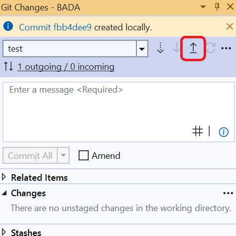

4. 깃허브 저장소에서 자신이 만든 브랜치 확인

    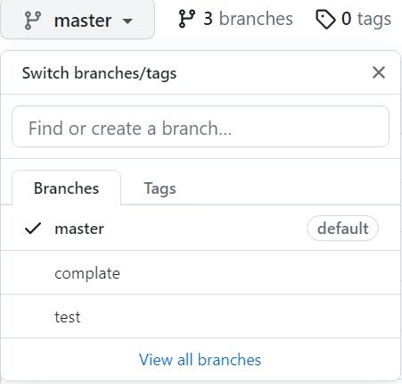
    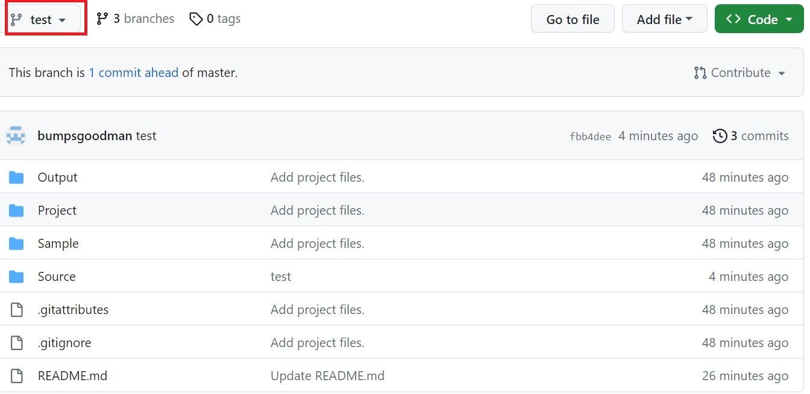

5. 앞으로 깃허브에 올릴 땐 자신이 만든 브랜치에 업로드한다.

## 사용 방법
### 기능
- F1 - 도움말
- F2 - 색상 선택 (Color Picker)
- F3 - 모두 지우기
- F5 - 되돌리기(Undo)
- F6 - 되돌리기 취소(Redo)

### 모드
- 1 - 픽셀 그리기
- 2 - 픽셀 지우기
- 3 - 채우기
- 4 - 가로 채우기
- 5 - 세로 채우기
- 6 - 사각형 그리기

색상 선택(F2)을 통해 선택된 색상으로 픽셀을 그린다.

사각형은 두 점(사각형의 좌측상단 및 우측하단)을 클릭하면 해당하는 크기의 사각형을 그려준다.

되돌리기(Undo)는 최근 256개의 명령만 되돌릴 수 있다.
